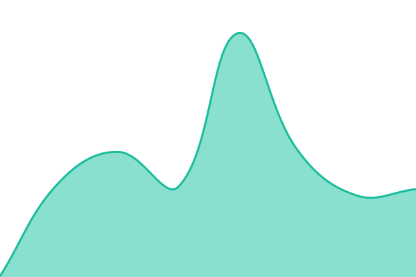

# [📈 Live Status](https://status.fossforall.org): <!--live status--> **🟩 All systems operational**

This repository contains the open-source uptime monitor and status page for [FOSS for All](https://fossforall.org/), powered by [Upptime](https://github.com/upptime/upptime).

With [Upptime](https://upptime.js.org), you can get your own unlimited and free uptime monitor and status page, powered entirely by a GitHub repository. We use [Issues](https://github.com/foss-for-all/upptime/issues) as incident reports, [Actions](https://github.com/foss-for-all/upptime/actions) as uptime monitors, and [Pages](https://status.fossforall.org) for the status page.

<!--start: status pages-->
<!-- This summary is generated by Upptime (https://github.com/upptime/upptime) -->
<!-- Do not edit this manually, your changes will be overwritten -->
<!-- prettier-ignore -->
| URL | Status | History | Response Time | Uptime |
| --- | ------ | ------- | ------------- | ------ |
|  [fossforall.org](https://fossforall.org) | 🟩 Up | [fossforall-org.yml](https://github.com/foss-for-all/upptime/commits/HEAD/history/fossforall-org.yml) | 

 181ms
     
 | 

<a href="https://status.fossforall.org/history/fossforall-org">100.00%</a>
    

|  chest | 🟩 Up | [chest.yml](https://github.com/foss-for-all/upptime/commits/HEAD/history/chest.yml) | 

 1158ms
     
 | 

<a href="https://status.fossforall.org/history/chest">100.00%</a>
    

|  office | 🟩 Up | [office.yml](https://github.com/foss-for-all/upptime/commits/HEAD/history/office.yml) | 

 1105ms
     
 | 

<a href="https://status.fossforall.org/history/office">100.00%</a>
    

|  [Single Sign On](https://sso.fossforall.org) | 🟩 Up | [single-sign-on.yml](https://github.com/foss-for-all/upptime/commits/HEAD/history/single-sign-on.yml) | 

 563ms
     
 | 

<a href="https://status.fossforall.org/history/single-sign-on">100.00%</a>
    

|  [Forum](https://forum.fossforall.org) | 🟩 Up | [forum.yml](https://github.com/foss-for-all/upptime/commits/HEAD/history/forum.yml) | 

 723ms
     
 | 

<a href="https://status.fossforall.org/history/forum">100.00%</a>
    

|  [2025.fossforall.org](https://2025.fossforall.org) | 🟩 Up | [2025-fossforall-org.yml](https://github.com/foss-for-all/upptime/commits/HEAD/history/2025-fossforall-org.yml) | 

 278ms
     
 | 

<a href="https://status.fossforall.org/history/2025-fossforall-org">100.00%</a>
    

|  [2026.fossforall.org](https://2026.fossforall.org) | 🟩 Up | [2026-fossforall-org.yml](https://github.com/foss-for-all/upptime/commits/HEAD/history/2026-fossforall-org.yml) | 

 162ms
     
 | 

<a href="https://status.fossforall.org/history/2026-fossforall-org">100.00%</a>
    

<!--end: status pages-->

[**Visit our status website →**](https://status.fossforall.org)

## 📄 License

- Powered by: [Upptime](https://github.com/upptime/upptime)
- Code: [MIT](./LICENSE) © [Anand Chowdhary](https://anandchowdhary.com), supported by [Pabio](https://pabio.com)
- Data in the `./history` directory: [Open Database License](https://opendatacommons.org/licenses/odbl/1-0/)
